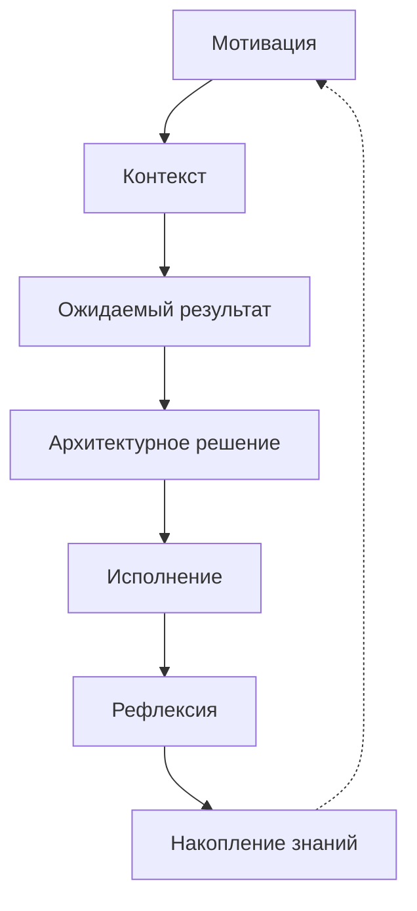

# Product Requirements Document: TDR Visualization Plugin

## 1. Введение

### 1.1 Цель продукта
Разработка плагина для DocHub, обеспечивающего интерактивную визуализацию и навигацию по модели архитектурных изменений (TDR).

### 1.2 Целевая аудитория
- Архитекторы
- Менеджеры проектов
- Команды разработки
- Стейкхолдеры проекта

## 2. Функциональные требования

### 2.1 Основные возможности визуализации

#### 2.1.1 Иерархическая визуализация
- Древовидное представление всей модели TDR
- Интерактивное раскрытие/скрытие узлов
- Цветовое кодирование разных уровней модели
- Быстрая навигация между разделами

#### 2.1.2 Циклическая визуализация
- Круговая диаграмма процесса изменений
- Визуализация связей между этапами
- Индикация текущего этапа
- Отображение прогресса по каждому этапу

#### 2.1.3 Матричная визуализация
- Матрица зависимостей между компонентами
- Тепловая карта влияния изменений
- Отображение критических путей
- Визуализация рисков и возможностей

### 2.2 Интерактивные функции

#### 2.2.1 Навигация
- Зум и пан для больших диаграмм
- Быстрый поиск по элементам
- Фильтрация по категориям
- Закладки для важных секций

#### 2.2.2 Редактирование
- Встроенный редактор YAML
- Валидация структуры данных
- Автодополнение на основе схемы
- История изменений

#### 2.2.3 Экспорт
- Экспорт в SVG/PNG
- Генерация PDF отчетов
- Шаринг ссылок на конкретные виды
- Экспорт в другие форматы (PPTX, DOC)

## 3. Технические требования

### 3.1 Технологический стек
- Vue.js 3.x для UI компонентов
- D3.js для визуализации
- Monaco Editor для редактирования YAML
- Mermaid.js для генерации диаграмм

### 3.2 Интеграция
- Поддержка DocHub Plugin API
- Работа с существующей моделью данных
- Интеграция с системой версионирования
- Поддержка тем оформления DocHub

## 4. Варианты визуализации

### 4.1 Основной вид: Process Flow


### 4.2 Detailed View: Component Matrix
```yaml
visualization:
  type: matrix
  components:
    - motivation
    - context
    - expected_result
    - architectural_solution
    - implementation
    - reflection
    - knowledge_accumulation
  relationships:
    - source: motivation
      target: context
      type: influences
    - source: context
      target: expected_result
      type: defines
```

### 4.3 Impact Analysis View
```yaml
visualization:
  type: heatmap
  metrics:
    - resource_impact
    - time_impact
    - risk_level
    - readiness
  scale:
    min: 0
    max: 100
  colorScheme: "RdYlGn"
```

## 5. Пользовательские сценарии

### 5.1 Архитектор
- Создание новой модели изменений
- Анализ влияния изменений
- Документирование решений
- Отслеживание прогресса

### 5.2 Менеджер проекта
- Мониторинг статуса изменений
- Оценка рисков
- Планирование ресурсов
- Генерация отчетов

### 5.3 Разработчик
- Понимание контекста изменений
- Отслеживание зависимостей
- Документирование реализации
- Обратная связь по решениям

## 6. Метрики успеха

### 6.1 Количественные
- Время создания новой визуализации < 5 минут
- Скорость загрузки визуализации < 2 секунды
- Поддержка моделей с > 1000 элементов
- Частота использования плагина

### 6.2 Качественные
- Удобство навигации
- Понятность визуализации
- Полезность для принятия решений
- Удовлетворенность пользователей

## 7. План реализации

### 7.1 Фаза 1: MVP (2 недели)
- Базовая древовидная визуализация
- Просмотр YAML данных
- Навигация по модели
- Базовый экспорт

### 7.2 Фаза 2: Enhanced (2 недели)
- Матричная визуализация
- Интерактивное редактирование
- Расширенная навигация
- Дополнительные форматы экспорта

### 7.3 Фаза 3: Advanced (2 недели)
- Циклическая визуализация
- Анализ влияния
- Интеграция с другими плагинами
- Расширенная аналитика

## 8. Риски и ограничения

### 8.1 Технические риски
- Производительность при больших моделях
- Совместимость с браузерами
- Сложность интеграции компонентов

### 8.2 Пользовательские риски
- Сложность восприятия визуализации
- Необходимость обучения
- Сопротивление изменениям
